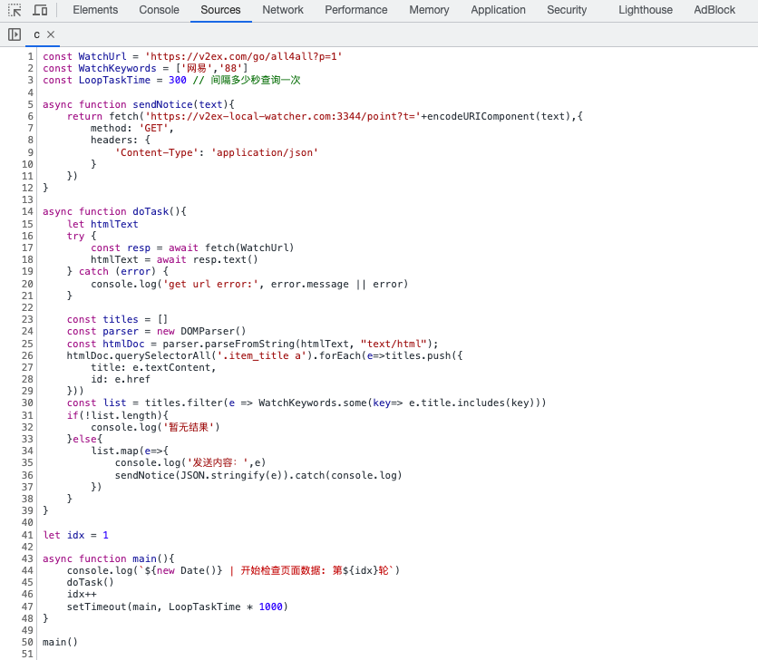
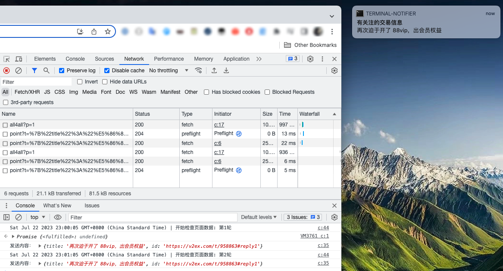

## v2 交易贴关键词实时监控和提醒服务（本地版）

> 此仓库仅作为记录和代码备份，编写的代码比较粗糙，讲究一个能用就行。

### 项目说明

因为临时想收个网易云会员，最近这个东西也比较抢手，需要时不时关注交易区，所以想找个工具来帮我实时关注一下交易帖子。

因为这需求也不复杂，就没多花精力去研究现有的工具，只用了一点简单的代码来实现。

大致原理是登陆 v2 后打开交易区，用 js 脚本来间隔请求最新交易帖子，筛选到关键词帖子后把数据发送给本地预先部署好的服务器，服务器调用系统通知提醒我。

### 环境要求

1. Mac
3. Chrome
5. Nodejs

### 部署流程

1. 下载代码到本地进入目录

    ```bash
    npm install
    ```

1. 使用 mkcert 生成 https 证书

    > [mkcert 参考链接](https://web.dev/how-to-use-local-https/)

    ```bash
    brew install mkcert

    mkcert -install

    mkcert v2ex-local-watcher.com

    mv ./v2ex-local* ./certs/ #移动证书到 certs 目录
    ````

2. 修改本地 hosts 配置添加下面记录

    `127.0.0.1 v2ex-local-watcher.com`

3. 运行本地服务器监听请求

    ```bash
    npm start
    # HTTPS server OK: http://v2ex-local-watcher.com:3344
    ```

5. 打开 v2 交易页，在 Chrome 里新建一个 snippet 脚本，复制当前目录下的 *snippet.js* 文件代码，修改相关配置，保存 snippet 开始执行即可

    

7. 当检测到关键词帖子后，会发送系统弹窗通知，点击即可打开对应页面。效果图如下：

    
